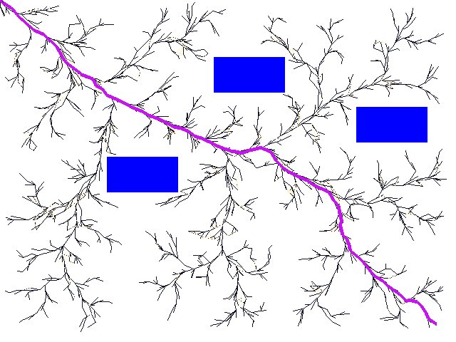

# RRT_Algorithms
This package has implementation of Bi-directional RRT* (extended tree from source and connected tree from destination). A comparison is made among RRT, RRT*, and Bi-directional RRT*. The results can be found in [this document](BiRRT_Star_Evaluation.pdf).

